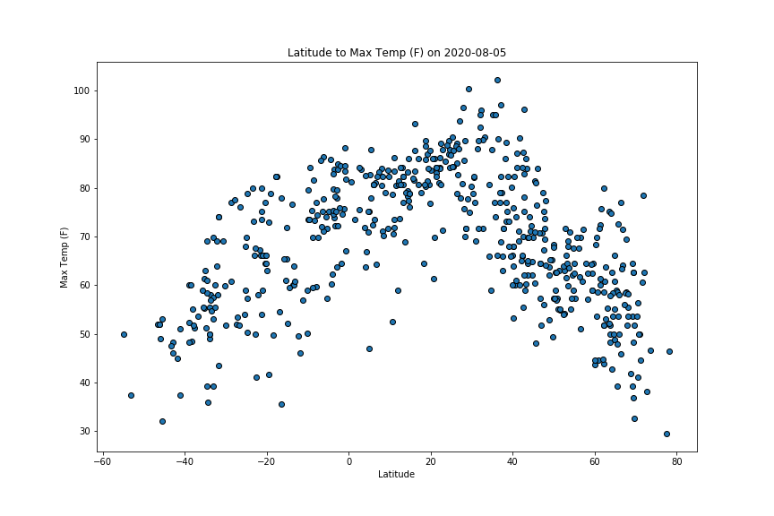
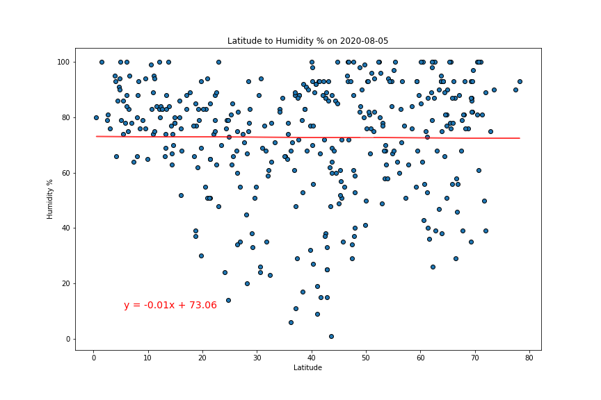
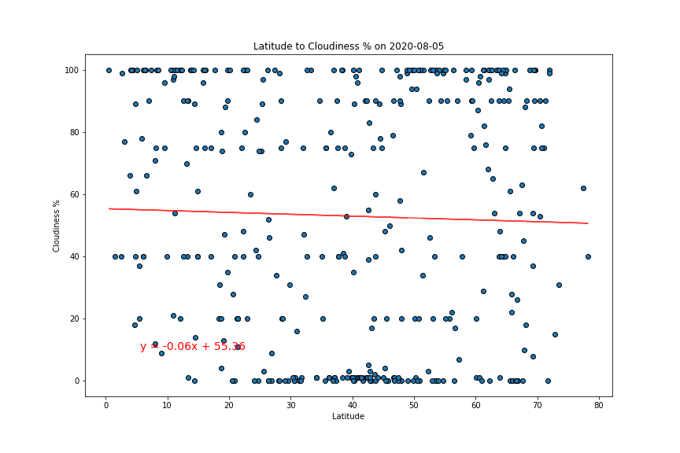
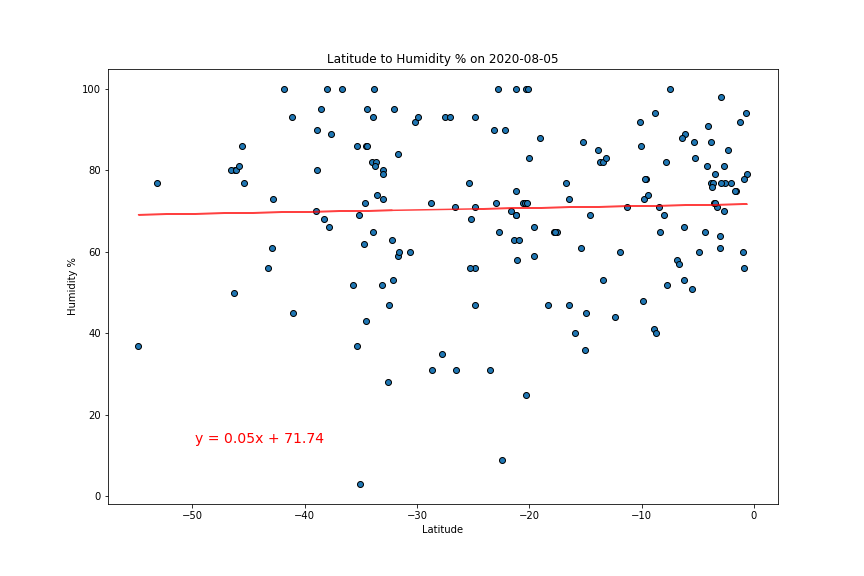
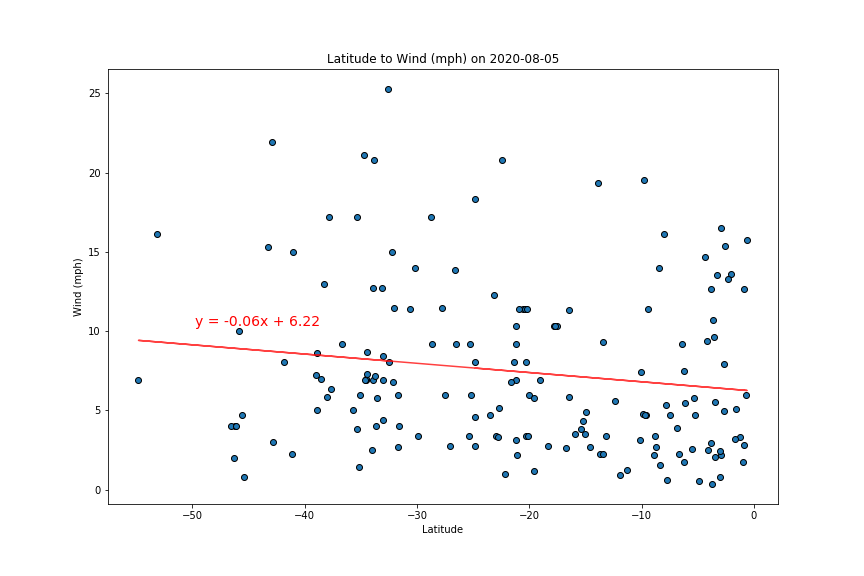

# WeatherPy and VacationPy Findings

# Comparing latitude values over various weather conditions

### Latitude vs Max Temperature (F)

### Latitude vs Humidity

### Latitude vs Cloud Cover (%)

### Latitude vs Wind Speed (mph)

# Regressive analyses of latitude over various weather conditions (by hemisphere)

### Northern Hemisphere: Latitude vs Max Temperature (F)

### Northern Hemisphere: Latitude vs Humidity (%)

### Northern Hemisphere: Latitude vs Cloud Cover

### Northern Hemisphere: Latitude vs Wind Speed (mph)

### Southern Hemisphere: Latitude vs Max Temperature (F)

### Southern Hemisphere: Latitude vs Humidity (%)

### Southern Hemisphere: Latitude vs Cloud Cover

### Southern Hemisphere: Latitude vs Wind Speed (mph)
